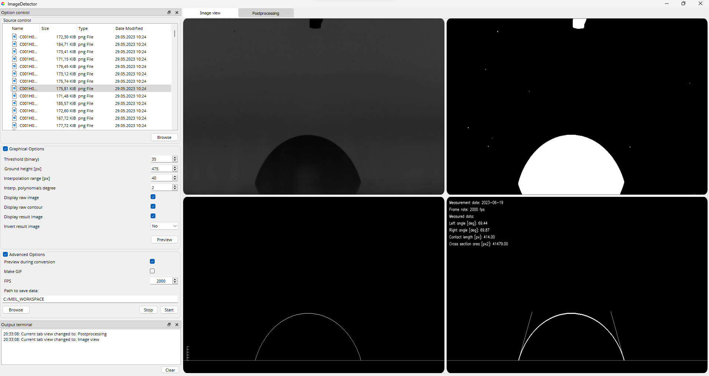
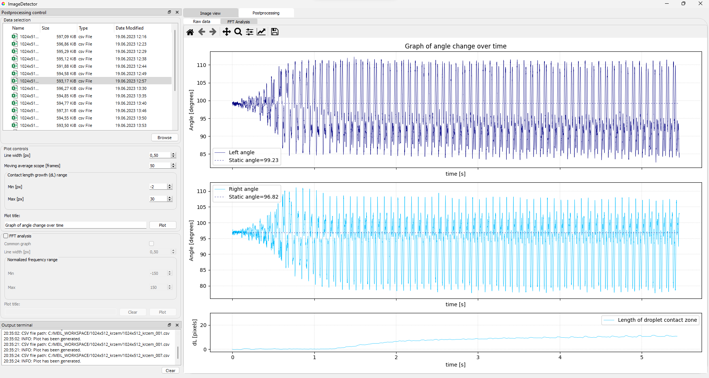
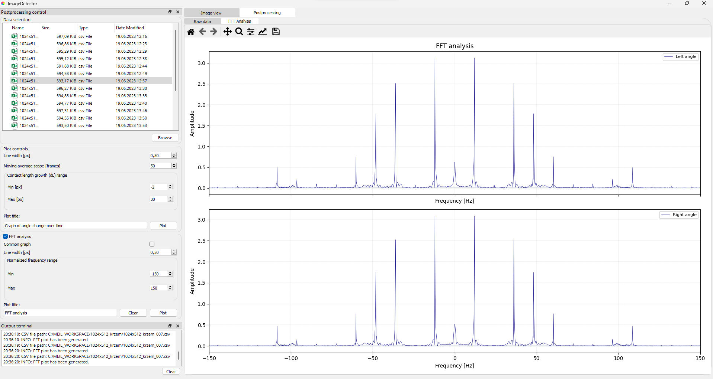

#   Master-thesis - image detector application
## Project Description
A project related to a master's thesis to facilitate the processing of results. The topic of the thesis is the dynamic measurement of wetting angle hysteresis. The application comes with an image processing algorithm that uses tools available in the open-cv library. Based on dynamic measurements of a droplet, whose movement is forced by a programmable actuator, the image is processed in such a way as to extract information from each frame of the recording:
* advancing and receding angle,
* length of the contact zone,
* cross-sectional area of the droplet.

FFT analysis was used to analyze the extracted data.

## Prerequisites
* opencv (4.7.0)
* PyQt5 (5.15.9)
## Python
* Matplotlib (3.7.1)
* Pandas (2.0.2)
* Numpy (1.24.3)
* Scipy (1.10.1)
## Developers guide
Clone `ImageDetector` repository:
```bash
$ git clone https://github.com/PawelekPro/Master-thesis.git .
$ cd ImageDetector
$ APP_ROOT=`pwd` # store path to root of the project, we will be refer to it below
```
Then create virtual environment:

```bash
$ python -m venv ${APP_ROOT}/.venv
```
>Note: `.venv` is a name of your virtual environment.
> 
Activate your virtual environment, upgrade `pip` and install requirements:

```bash
$ source ${APP_ROOT}/.venv/bin/activate
(.venv) $ python -m pip install pip --upgrade
(.venv) $ python -m pip install -r ${APP_ROOT}/requirements.txt
```

Convert Qt user interface (`ui`) and resources (`ui`) files (optional, as newest
version of this files are also added to repository):
```bash
To be done
```
> Note: `pyuic5` and `pyrcc5` should be installed by `pip` in your virtual
> environment(`.venv/bin/pyuic5`)


## Release python executable
1. Install `pip` and then `PyInstaller`:
```bash
$ python -m pip install pyinstaller
```
2. Build executable:
```bash
$ pyinstaller imageDetector_app.spec
```
Executable file will be built in `${APP_ROOT}\build\imageDector` folder.

## Usage
Data sample (images from measurement) is available `${APP_ROOT}\data_sample`.



Postprocessing module (graph of angle change over time):



Postprocessing module (FFT Analysis): 

